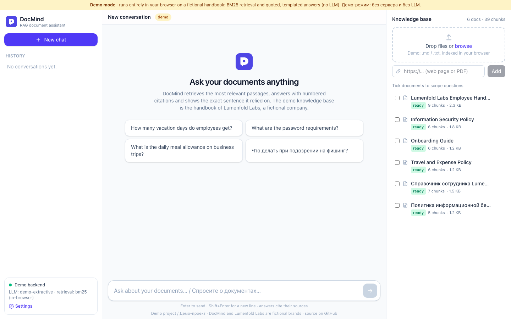
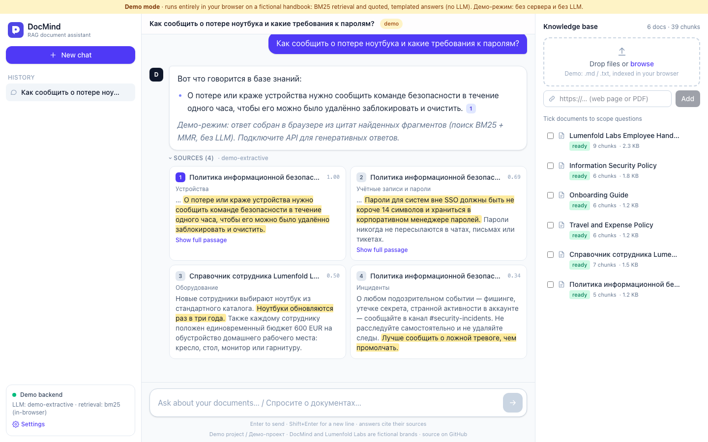

# DocMind — RAG-ассистент по документам

[](https://github.com/sinnercode228/docmind-rag/actions/workflows/ci.yml)
[](https://sinnercode228.github.io/docmind-rag/)


**Живое демо:** https://sinnercode228.github.io/docmind-rag/ (работает без сервера, см. «Демо-режим»)

> **Демо-проект.** DocMind и компания Lumenfold Labs вымышлены; все документы в `sample-kb/` написаны специально для демо.

[English version below](#english)


## Что это

DocMind — сервис вопросов и ответов по вашим документам (retrieval-augmented generation). Загружаете PDF, DOCX, Markdown или ссылку на страницу, задаёте вопрос и получаете потоковый ответ с пронумерованными ссылками `[1]`, `[2]`. У каждой ссылки есть фрагмент источника, в котором подсвечено предложение, на которое опирается ответ.

| Слой | Что внутри |
|---|---|
| **Загрузка** | PDF (pypdf, номера страниц), DOCX (включая таблицы), Markdown/HTML/TXT, URL с защитой от SSRF. Индексация идёт в фоне: очередь задач, повторные попытки, статусы `queued → processing → ready/failed` |
| **Чанкинг** | Разбивка с учётом заголовков и нахлёстом; у каждого чанка сохраняются заголовок и страница |
| **Эмбеддинги** | Офлайн hashing-эмбеддер (детерминированный, без скачивания моделей) или любой OpenAI-совместимый `/embeddings` |
| **Векторное хранилище** | `pgvector` (Postgres, в docker compose) или in-memory на numpy со снапшотами (для разработки и тестов) |
| **Поиск** | Плотный поиск кандидатов `fetch_k`, затем MMR-переранжирование до `top_k`; фильтр по выбранным документам |
| **LLM** | Одна абстракция `LLMProvider` и три реализации: Anthropic Claude SDK, OpenAI-совместимый API (Ollama, vLLM, LM Studio…) и детерминированный `Fake` для тестов и демо |
| **API** | FastAPI, стриминг через SSE (`meta → sources → delta… → done`), авторизация по API-ключу (`X-API-Key` или Bearer), мультитенантность, история диалогов, OpenAPI на `/docs` |
| **Telegram** | Адаптер на aiogram 3: бот ходит в API как обычный клиент (`/new`, `/help`, вопросы текстом, ответы с источниками) |
| **Фронтенд** | Vite + React 19 + TypeScript (strict) + Tailwind v4: чат со стримингом, панель загрузки (drag-and-drop, URL), карточки цитат с подсветкой, история чатов, выбор документов для поиска, тёмная тема |

## Архитектура

```
             ┌──────────── web (React) ────────────┐        ┌── Telegram (aiogram) ──┐
             │ HttpClient ──SSE──►   │ DemoClient  │        │   bot → HTTP client    │
             └──────────┬──────────┴──────────────┘         └───────────┬────────────┘
                        │ /v1/*  X-API-Key                              │
                  ┌─────▼──────────────── FastAPI ───────────────────────▼─────┐
                  │ routes → RagService ──► Retriever (dense + MMR) ─► VectorStore
                  │            │                                  (pgvector | memory)
                  │            └──► LLMProvider (Claude | OpenAI-compat | Fake)
                  │ JobRunner (фоновая индексация) → loaders → chunking → Embedder
                  └──────────── SQLAlchemy (Postgres | SQLite): tenants, docs, jobs, chats
```

Зависимости собираются в одном `Container` (`backend/src/docmind/container.py`), поэтому в тестах любой компонент заменяется фейком: сеть не нужна, Docker не нужен.

## Демо-режим (GitHub Pages)

Статическая сборка работает без бэкенда. Вместо `HttpClient` подключается `DemoClient` с тем же интерфейсом `DocMindClient`:

- заранее нарезанная база знаний: `docmind export-demo-kb sample-kb …` сохраняет чанки из `sample-kb/*.md` в `frontend/src/demo/kb.json`;
- поиск прямо в браузере: BM25 со стеммингом для EN/RU и MMR-диверсификация;
- ответы собираются по шаблону из цитат: лучшее предложение каждого релевантного источника плюс номер `[n]`. LLM нет, и интерфейс прямо об этом пишет;
- можно добавить свои `.md`/`.txt`, они индексируются в браузере. PDF, DOCX и URL требуют настоящего API.

Переключиться на реальный API можно через **Settings** в интерфейсе (URL и ключ хранятся в `localStorage`) или при сборке: `VITE_DOCMIND_MODE=api`, `VITE_DOCMIND_API_URL`, `VITE_DOCMIND_API_KEY`. Параметр `?q=вопрос` в ссылке сразу задаёт вопрос.

## Быстрый старт

**Требования:** Python 3.12+ (проверено на 3.14), Node 20+ (проверено на 25).

```bash
make setup          # backend/.venv + npm install
make api            # API: http://localhost:8000/docs  (SQLite, in-memory векторы, Fake LLM, ключ dm_local_dev_key)
make web            # UI:  http://localhost:5173       (режим api, прокси /v1 → :8000)
```

Индексация и вопросы из CLI:

```bash
cd backend
.venv/bin/docmind ingest --api-key dm_local_dev_key ../sample-kb
.venv/bin/docmind ask --api-key dm_local_dev_key "How many vacation days do employees get?"
```

Настоящая LLM (переменные окружения или `backend/.env`, полный список в `.env.example`):

```bash
DOCMIND_LLM_PROVIDER=anthropic DOCMIND_ANTHROPIC_API_KEY=... make api
# или любой OpenAI-совместимый сервер, например Ollama:
DOCMIND_LLM_PROVIDER=openai DOCMIND_OPENAI_BASE_URL=http://localhost:11434/v1 DOCMIND_OPENAI_MODEL=llama3.1 make api
```

**Docker (Postgres + pgvector, API, UI):**

```bash
cp .env.example .env
docker compose up --build                      # UI: http://localhost:8080, API: http://localhost:8000/docs
docker compose --profile telegram up --build   # плюс Telegram-бот (нужен DOCMIND_TELEGRAM_BOT_TOKEN)
```

Только демо-сборка: `cd frontend && npm run build:pages` (base `/docmind-rag/`).

## Пример API

```bash
KEY=dm_local_dev_key
curl -H "X-API-Key: $KEY" -F file=@handbook.pdf http://localhost:8000/v1/documents        # 202 + job
curl -H "X-API-Key: $KEY" -H 'Content-Type: application/json' \
     -d '{"url":"https://example.com/docs"}' http://localhost:8000/v1/documents/url
curl -N -H "X-API-Key: $KEY" -H 'Content-Type: application/json' \
     -d '{"question":"What is the learning budget?"}' http://localhost:8000/v1/chat/stream
```

```
event: meta     data: {"conversation_id": "cv_…"}
event: sources  data: {"citations": [{"index": 1, "document_title": "…", "snippet": "…", "highlight": [0, 86], …}]}
event: delta    data: {"text": "Each "}
…
event: done     data: {"answer": "…", "cited": [1], "model": "…", "stop_reason": "end_turn"}
```

Эндпоинты: `/v1/documents` (upload/url/text/list/get/delete/reindex), `/v1/jobs/{id}`, `/v1/chat`, `/v1/chat/stream`, `/v1/search`, `/v1/conversations`, `/v1/me`, `/v1/admin/tenants`, `/healthz`, `/readyz`.

## Тесты и качество

| | Инструменты | Результат |
|---|---|---|
| Backend | pytest + pytest-asyncio, фейки для LLM, эмбеддингов и HTTP (без сети и Docker); ruff; mypy `--strict` | **101 тест** |
| Frontend | Vitest + Testing Library (jsdom); ESLint; `tsc` strict | **26 тестов** |

```bash
make test && make lint
```

CI (`.github/workflows/ci.yml`): линтеры, типы, тесты, сборка фронтенда и Docker-образов. Деплой демо (`.github/workflows/pages.yml`): GitHub Actions → `upload-pages-artifact` → `deploy-pages` (в настройках репозитория: Pages → Source: GitHub Actions).

## Скриншоты

| Стартовый экран | Ответ на русском |
|---|---|
|  |  |

## Структура

```
backend/   FastAPI-приложение (src/docmind: api, ingestion, embeddings, vectorstore, retrieval, llm, rag, jobs, bot, db) + tests
frontend/  Vite + React + TS + Tailwind (src/api, src/demo, src/lib, src/components, src/state)
sample-kb/ вымышленный справочник Lumenfold Labs (EN + RU) для демо
docs/      скриншоты
```

---

<a id="english"></a>

# DocMind: RAG document assistant (English)

**Live demo:** https://sinnercode228.github.io/docmind-rag/ (runs without a server in demo mode)

> **Demo project.** DocMind and Lumenfold Labs are fictional; every document in `sample-kb/` was written for this demo.

DocMind answers questions about your documents. Upload PDFs, DOCX, Markdown or a web page, ask a question, and get a streamed answer with numbered citations. Each citation opens the source passage with the supporting sentence highlighted.

**Backend (FastAPI, Python 3.12+):**
- **Ingestion:** PDF (with page numbers), DOCX (including tables), Markdown, HTML, TXT and URLs (with an SSRF guard). Indexing runs as a background job with retries and status tracking.
- **Retrieval pipeline:** heading-aware chunking with overlap, then embeddings (offline hashing embedder or any OpenAI-compatible `/embeddings`). Vectors go to **pgvector** or an in-memory numpy store. Retrieval takes the nearest candidates, then re-ranks them with **MMR**.
- **LLMs:** one `LLMProvider` interface with three backends: the **Anthropic Claude SDK**, **OpenAI-compatible** servers (Ollama, vLLM and similar) and a deterministic **Fake** for tests and demos.
- **API:** **SSE streaming** (`meta → sources → delta… → done`), **API-key auth** with multi-tenancy, conversation history and OpenAPI docs at `/docs`.
- **Telegram:** an **aiogram 3** bot that uses the API like any other client.

**Frontend (Vite, React 19, strict TypeScript, Tailwind v4):**
- Streaming chat with a stop button.
- Upload panel with drag-and-drop and URL ingest, plus live ingestion status.
- Citation cards with highlighted snippets.
- Local chat history, per-document scoping and a dark theme.

**Demo mode (GitHub Pages).** `DemoClient` implements the same `DocMindClient` interface as the HTTP client. It ships a pre-chunked fictional handbook, exported with `docmind export-demo-kb`. It ranks passages in the browser with BM25 (English and Russian stemming) plus MMR. Answers are **templated from quoted sentences**, with no LLM, and the UI labels them that way. You can add your own `.md` or `.txt` files in the browser. To use the real API, open **Settings** in the UI or build with `VITE_DOCMIND_MODE=api`.

### Run

```bash
make setup     # backend venv + npm install
make api       # http://localhost:8000/docs  (SQLite, in-memory vectors, Fake LLM, key dm_local_dev_key)
make web       # http://localhost:5173
docker compose up --build   # Postgres+pgvector, API :8000, UI :8080 (add --profile telegram for the bot)
```

Set `DOCMIND_LLM_PROVIDER=anthropic` with `DOCMIND_ANTHROPIC_API_KEY`, or `openai` with `DOCMIND_OPENAI_BASE_URL`, to get generated answers. All settings are listed in `.env.example`.

### Quality

- Backend: **101 pytest tests** (no network, no Docker), ruff, mypy `--strict`.
- Frontend: **26 Vitest tests**, ESLint, strict `tsc`.
- CI runs lint, type checks, tests and builds, including the Docker images.
- The Pages demo is deployed by `.github/workflows/pages.yml`, using GitHub Actions as the Pages source.

## License

MIT. Author: [sinnercode228](https://github.com/sinnercode228) · Telegram [@sinnercode](https://t.me/sinnercode)
