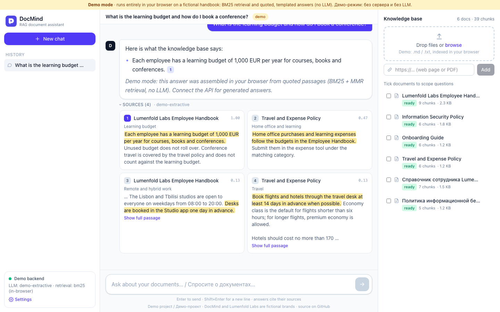

# DocMind

**Русский** · [English](README.en.md)

Загружаешь PDF, DOCX, Markdown, HTML, TXT или ссылку и задаёшь вопрос; ответ идёт потоком с пометками `[1]`, `[2]`, а клик по пометке прокручивает к карточке с фрагментом источника и подсвеченным предложением. Бэкенд на FastAPI (Python 3.12+, SQLAlchemy async, SQLite или Postgres + pgvector) индексирует документы в фоне; к нему есть CLI, Telegram-бот на aiogram 3 и веб-интерфейс на React 19, TypeScript, Vite и Tailwind v4. Без ключей отвечает детерминированный `FakeLLM` цитатами из найденного, а Claude через Anthropic SDK или OpenAI-совместимый API подключаются переменными окружения.

Демо: https://sinnercode228.github.io/docmind-rag/ (работает целиком в браузере). В базе шесть документов придуманной компании Lumenfold Labs, четыре на английском и два на русском; для начала подойдёт `What is the learning budget?`.



Ответ в демо собран без LLM, по одному подсвеченному предложению из источника; карточки 2–4 не прошли пороги отбора, поэтому вторая половина вопроса, про конференцию, осталась без ответа.

## Что происходит, когда задаёшь вопрос

Ответ идёт по SSE, события приходят в порядке `meta → sources → delta… → done`; если что-то упало уже после старта потока, приходит `error`. Так выглядит поток от `make api` с загруженным `sample-kb/` на вопрос `What is the learning budget?` (сокращено):

```
event: meta
data: {"conversation_id": "cv_…", "user_message_id": "msg_…"}

event: sources
data: {"citations": [{"index": 1, "document_title": "Lumenfold Labs Employee Handbook", "snippet": "Each employee has a learning budget of 1,000 EUR per year…", "score": 0.4292, "heading": "Learning budget", "highlight": [0, 93], …}, …]}

event: delta
data: {"text": "Here "}
…
event: done
data: {"message_id": "msg_…", "answer": "…", "cited": [1, 2], "model": "fake-extractive", "stop_reason": "end_turn", "usage": {"input_tokens": null, "output_tokens": 56}}
```

1. [`useChat`](frontend/src/state/useChat.ts) через [`HttpClient.chat`](frontend/src/api/httpClient.ts) шлёт `POST /v1/chat/stream` с ключом в `X-API-Key`; в теле вопрос, `conversation_id` и выбранные `document_ids`. Поток читаю через `fetch`, потому что `EventSource` умеет лишь GET без своих заголовков.
2. Парсер [`lib/sse.ts`](frontend/src/lib/sse.ts) приводит CRLF к `\n`, склеивает многострочный `data:`, держит в буфере сообщение, разрезанное между чанками, и дочитывает последнее, если поток закрылся без пустой строки; эти случаи разобраны в [`sse.test.ts`](frontend/src/lib/sse.test.ts). Байты декодирует `TextDecoder` с `stream: true`, и разрезанная между чанками кириллическая буква не превращается в `�`.
3. [`routes_chat.py`](backend/src/docmind/api/routes_chat.py) проверяет `conversation_id` до открытия потока, так что на несуществующий или чужой разговор приходит обычный 404. Потом вопрос сохраняется и уходит `meta`; статус 200 к этому моменту уже отправлен, и дальнейшие ошибки идут событием `error`. Историю фронт не пересылает: последние 4 пары вопрос–ответ бэкенд достаёт из своей базы сам.
4. [`Retriever`](backend/src/docmind/retrieval/retriever.py) берёт ближайшие к вопросу чанки по косинусу, отбрасывает слабые и дубли по тексту, и MMR оставляет из них 5. Эмбеддер по умолчанию лексический — feature hashing слов, биграмм и символьных триграмм ([`hashing.py`](backend/src/docmind/embeddings/hashing.py)), и «ближайший» здесь значит «с похожими словами», а не «о том же».
5. Источники уходят событием `sources` до вызова модели ([`rag/service.py`](backend/src/docmind/rag/service.py)). Карточки видны раньше первого токена, а `[n]` в потоке сразу становится кнопкой; номер больше числа источников остаётся текстом ([`AnswerText.tsx`](frontend/src/components/AnswerText.tsx)). Предложение для подсветки [`best_sentence`](backend/src/docmind/text.py) выбирает по общим словам с вопросом, а не с ответом, и с настоящей LLM подсвеченным может оказаться не то предложение, на которое опиралась модель.
6. Дальше идут `delta` с кусками текста. В `done` приходят полный ответ, `model`, `stop_reason`, usage и `cited` (номера `[n]` из ответа, не больше числа источников). У процитированных карточек номер закрашивается, ответ сохраняется в базу вместе с источниками, и у каждого проставлен флаг `cited`. Порядок событий задаёт один async-генератор `_chat_events`; нестриминговый `/v1/chat` прогоняет его до конца и собирает из событий JSON, так что логика двух эндпоинтов не расходится.

Каждый запрос к `/v1` идёт с ключом тенанта, в `X-API-Key` или как Bearer. В базе лежит только sha256 ключа, документы, векторы и разговоры выбираются с фильтром по `tenant_id`. `test_tenants_are_isolated` в [`test_api.py`](backend/tests/test_api.py) проверяет, что с чужим ключом документ не найти ни в списке, ни по id, ни поиском.

В Docker между браузером и API стоит nginx. Для `/v1/` в [`frontend/nginx.conf`](frontend/nginx.conf) выключены `proxy_buffering` и `proxy_cache`, иначе nginx копил бы дельты в буфере и текст приходил бы пачками; `proxy_read_timeout` поднят до 300 с. Бэкенд вдобавок отвечает с `X-Accel-Buffering: no`; этот заголовок nginx читает из ответа upstream, и поток не застрянет даже за nginx с чужим конфигом.

Telegram-бот ([`bot/telegram.py`](backend/src/docmind/bot/telegram.py)) ходит в тот же `/v1/chat/stream` как обычный клиент и стримит ответ правкой одного сообщения, не чаще раза в 1.2 с ([`bot/service.py`](backend/src/docmind/bot/service.py)). Markdown из ответа переводится в HTML-разметку Telegram; если Telegram её не принимает (`TelegramBadRequest`), финальная правка повторяется с `parse_mode=None`.

## Нарезка на чанки

Загрузчик ([`loaders.py`](backend/src/docmind/ingestion/loaders.py)) на pypdf, python-docx и BeautifulSoup сначала делит документ на секции: Markdown по заголовкам, DOCX по стилям `Heading*` (все таблицы дописываются в конец последней секции строками `ячейка | ячейка`), HTML по `h1`–`h4` после удаления `nav`, `footer`, `script` и прочей обвязки, PDF по страницам. TXT, Markdown и HTML декодируются по цепочке utf-8 → cp1251 → latin-1, и русский `.txt` в cp1251 читается как есть.

Сплиттер ([`chunking.py`](backend/src/docmind/ingestion/chunking.py)) работает внутри одной секции и через её границу не переходит, поэтому у чанка всегда один заголовок и одна страница. По умолчанию 900 символов на чанк и 150 перекрытия (`DOCMIND_CHUNK_SIZE`, `DOCMIND_CHUNK_OVERLAP`), демо-база экспортируется с 700/100.

- Режет рекурсивно: сначала по `\n\n`; если кусок всё ещё больше лимита, по `\n`, потом по `. `, `? `, `! `, `; `, `, ` и пробелу. Когда разделителей не осталось, режет по длине.
- Потом жадно склеивает соседние куски обратно, пока чанк влезает в `chunk_size`.
- Перекрытие делается шагом назад по целым кускам и не превышает `chunk_overlap`. Шаг назад ограничен условием `k - 1 > i`: следующий чанк начинается хотя бы на один кусок дальше предыдущего и цикл не зависает; `test_chunks_respect_size_and_cover_text` проверяет это на каждой паре соседних чанков.
- Текст режется только до уровня, на котором куски влезают в `chunk_size`. Если абзацы короче лимита, кусками остаются целые абзацы, и перекрытие появляется, только когда последний абзац чанка не длиннее `chunk_overlap`. В `sample-kb` каждая секция и так помещается в один чанк (39 секций, 39 чанков), перекрытий там нет.
- Для Markdown в `heading` пишется путь по заголовкам, например `Time off › Paid vacation`. H1 считается названием документа и в путь не попадает, если под ним есть подзаголовок. `#` внутри блока кода заголовком не считается.

## SSRF при загрузке по ссылке

URL скачивается в фоновой задаче через [`fetch.py`](backend/src/docmind/ingestion/fetch.py):

- схемы только `http` и `https`, URL с `user:pass@` отклоняется;
- хост резолвится, и все его адреса должны быть глобальными: если имя отдаёт один публичный IP и `127.0.0.1`, запрос не уходит. Проверенный IP при этом не фиксируется, и при подключении httpx резолвит имя заново, оставляя между проверкой и запросом окно для DNS rebinding;
- редиректы httpx сам не проходит (`follow_redirects=False`), каждый `Location` заново проверяется тем же guard, максимум 5 переходов;
- размер проверяется по `Content-Length` до чтения тела и по факту во время потокового чтения, лимит как у загрузки файла, 20 МБ. Таймаут httpx 15 с действует на каждую операцию, общего лимита на время скачивания нет.

В [`test_fetch.py`](backend/tests/test_fetch.py) есть `ftp://` и `file://`, адреса `10.0.0.7` и `169.254.169.254`, редирект с публичного хоста на `169.254.169.254`, петля редиректов и ответ с `Content-Length` больше лимита. Отклонённая ссылка API не роняет: документ получает статус `failed` с текстом ошибки (`test_url_blocked_by_ssrf_guard_fails_job` в [`test_api.py`](backend/tests/test_api.py)). Для внутренней сети проверку выключает `DOCMIND_ALLOW_PRIVATE_URLS=true`.

## Демо-клиент на BM25

Сборка для Pages (`npm run build:pages`) берёт `VITE_DOCMIND_MODE=demo` из [`.env.pages`](frontend/.env.pages), и UI получает вместо `HttpClient` [`DemoClient`](frontend/src/demo/demoClient.ts). Оба реализуют `DocMindClient`, демо-клиент отдаёт события в том же порядке, и `useChat` про подмену не знает. Свои `.md` и `.txt` до 2 МБ можно добавить прямо в браузере; PDF, DOCX и ссылки требуют API. На настоящий бэкенд переключает диалог Settings, адрес и ключ сохраняются в `localStorage`.

База знаний лежит в [`kb.json`](frontend/src/demo/kb.json). Её делает `docmind export-demo-kb` (`make demo-kb`) из `sample-kb/*.md` теми же загрузчиками и `chunk_document`, что и сервер: 6 документов, 39 чанков. Файлы обходятся в порядке сортировки имён, id чанка — blake2b от id документа, порядкового номера и текста, поэтому повторный экспорт даёт тот же файл байт в байт.

Поиск идёт в браузере: BM25 (k1 = 1.4, b = 0.75) по стеммированным словам, заголовок индексируется вместе с текстом ([`bm25.ts`](frontend/src/lib/bm25.ts)). Из 16 кандидатов MMR по сходству Жаккара между наборами слов оставляет 4. Токенизация, суффиксный стеммер для русского и английского и выбор предложения портированы из `text.py` в [`text.ts`](frontend/src/lib/text.ts). Ответ собирается по шаблону: подсвеченное предложение источника плюс `[n]`, не больше трёх пунктов. Источник с нормированным score ниже 0.35 пропускается, а каждый следующий пункт должен покрывать не меньше 75% от числа слов вопроса, которые покрыл первый. Язык ответа, как и у `FakeLLM`, выбирается по кириллице в вопросе.

## Что упрощено

- Поиск на бэкенде векторный с MMR, без гибрида и реранкера; BM25 есть только в браузерном демо.
- Упавшая индексация сама не повторяется и остаётся `failed` до `POST /v1/documents/{id}/reindex`; после рестарта в очередь снова встают только незавершённые задачи ([`runner.py`](backend/src/docmind/jobs/runner.py)).
- От prompt injection защищает одна строка в системном промпте ([`prompt.py`](backend/src/docmind/rag/prompt.py)); название и расположение источника экранируются, сам текст фрагмента уходит в модель как есть.
- Схема создаётся через `create_all`, миграций нет. `content_hash` пишется, но не проверяется, поэтому повторно загруженный файл индексируется ещё раз.

## Запуск

Быстрее всего посмотреть демо по ссылке выше. Локально с бэкендом:

```bash
make setup                                        # backend/.venv + npm install
DOCMIND_MEMORY_STORE_PATH=data/vectors make api   # http://localhost:8000/docs: SQLite, FakeLLM, ключ dm_local_dev_key
make web                                          # http://localhost:5173: UI в режиме api, Vite проксирует /v1 на :8000
```

Без `DOCMIND_MEMORY_STORE_PATH` векторы живут только в памяти процесса: после перезапуска API (в том числе от `--reload` при правке кода) документы в SQLite числятся `ready`, а поиск пустой. С переменной хранилище после каждого изменения пишет снапшот в `backend/data/vectors` (`data/` в `.gitignore`). CLI `ingest` и `ask` запускаются отдельными процессами, и им переменная нужна обязательно:

```bash
cd backend
export DOCMIND_MEMORY_STORE_PATH=data/vectors
.venv/bin/docmind ingest --api-key dm_local_dev_key ../sample-kb
.venv/bin/docmind ask --api-key dm_local_dev_key "How many vacation days do employees get?"
```

По умолчанию отвечает `FakeLLM`: из найденных фрагментов по очереди берёт лучшее предложение (не больше трёх) и ставит к нему `[n]`. Настоящая модель подключается переменными окружения или через `backend/.env`:

```bash
DOCMIND_LLM_PROVIDER=anthropic DOCMIND_ANTHROPIC_API_KEY=... make api
DOCMIND_LLM_PROVIDER=openai DOCMIND_OPENAI_BASE_URL=http://localhost:11434/v1 DOCMIND_OPENAI_MODEL=llama3.1 make api
```

Провайдер Anthropic при `stop_reason: refusal` дописывает в ответ пометку, что модель отказалась отвечать. Для семантического поиска нужны `DOCMIND_EMBEDDER=openai`, OpenAI-совместимый `/embeddings` (`DOCMIND_EMBEDDING_BASE_URL`, `DOCMIND_EMBEDDING_MODEL`, `DOCMIND_EMBEDDING_API_KEY`) и `DOCMIND_EMBEDDING_DIM`, равный размерности модели: параметр `dimensions` в запрос не передаётся, а по умолчанию ожидается 384. В `.env.example` только основные переменные, полный список настроек лежит в [`config.py`](backend/src/docmind/config.py).

Docker поднимает Postgres 17 с pgvector (HNSW-индекс по косинусу), API и UI за nginx. Compose передаёт `DOCMIND_BOOTSTRAP_API_KEY` в сборку фронта как `VITE_DOCMIND_API_KEY`, и ключ оказывается в JS-бандле; локально это удобно, но открывать такой стенд наружу нельзя (CORS по умолчанию тоже `*`), а ключ из `.env.example` стоит заменить на свой.

```bash
cp .env.example .env
docker compose up --build                      # UI: http://localhost:8080, API: http://localhost:8000/docs
docker compose --profile telegram up --build   # плюс бот: нужны DOCMIND_TELEGRAM_BOT_TOKEN и DOCMIND_TELEGRAM_API_KEY
```

## Тесты

| | Что | Сколько |
|---|---|---|
| Backend | pytest + pytest-asyncio. LLM в тестах API — `FakeLLM`, эмбеддинги — офлайн-хэширование; клиенты Anthropic и OpenAI-совместимых API и `fetch.py` проверяются через `httpx.MockTransport`, DNS подменён. Сеть и Docker не нужны | 101 тест, покрытие 76% (с учётом веток) |
| Frontend | Vitest + Testing Library: SSE-парсер, HTTP-клиент, BM25, текстовые утилиты, демо-клиент, App | 26 тестов |

```bash
make test && make lint   # ruff, ruff format --check, mypy (strict); eslint, tsc
```

Без тестов остались хранилище pgvector, Telegram-бот и CLI: в отчёте покрытия у них 0%. CI ([`ci.yml`](.github/workflows/ci.yml)) на Python 3.13 и Node 22 гоняет линтеры, типы, тесты, сборку демо и `docker compose build`; [`pages.yml`](.github/workflows/pages.yml) выкладывает демо.

---

Автор — Грешный Котик, беру заказы на похожие задачи: Telegram [@sinnercode](https://t.me/sinnercode). Лицензия [MIT](LICENSE).
